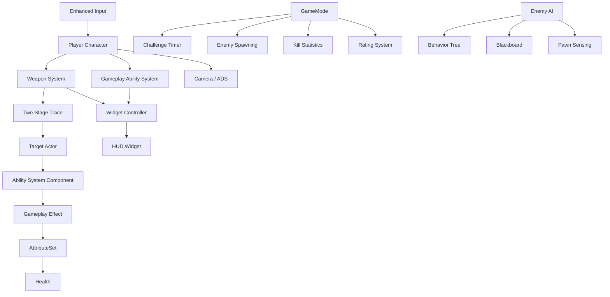

# 🎯 PyramidKillTrial

> A UE5 C++ first-person time-limited shooting challenge developed independently.


**PyramidKillTrial** is a first-person shooting challenge built with **Unreal Engine 5 + C++**.

The player has **90 seconds** to defeat as many randomly spawning enemies as possible.  
The final score is determined by the number of kills, with ratings ranging from **S to D**.

If the player dies before the timer expires, the challenge ends immediately with a **Mission Failed** result.

---

## 🎮 Gameplay

The core gameplay loop is simple:

```text
Start Challenge
      ↓
90-Second Countdown
      ↓
Random Enemy Spawning
      ↓
Shoot & Defeat Enemies
      ↓
Track Kill Count
      ↓
Timer Ends / Player Dies
      ↓
Final Result & Rating
```

### Core Features

- ⏱️ 90-second time-limited shooting challenge
- 👾 Randomly spawning enemies
- 🔫 First-person weapon system
- 🎯 ADS / aiming system
- 🔄 Reload system
- 🔀 Semi-auto / full-auto fire mode switching
- 🤖 Enemy patrol, detection, chase and attack
- ❤️ Player and enemy health system
- 📊 Real-time kill count and countdown
- 🏆 S / A / B / C / D performance rating
- 💀 Mission Failed state when the player dies
- 🔊 Dynamic combat and weapon audio
- ✨ Niagara-based combat effects
- 🎨 Complete start, tutorial and result UI

---

## 📸 Screenshots

### Main Menu


### Tutorial


### Combat


### Combat — Multiple Enemies


### Mission Complete


---

## 🕹️ Controls

| Input | Action |
|---|---|
| `W A S D` | Move |
| `Space` | Jump |
| `Left Shift` | Sprint |
| `Left Mouse Button` | Fire |
| `Right Mouse Button` | Aim / ADS |
| `R` | Reload |
| `B` | Switch Fire Mode |

### Fire Modes

Press `B` to switch between:

```text
Full Auto
    ↕
Semi Auto
```

---

# 🧩 Technical Highlights

## 1. Two-Stage Weapon Trace

Instead of directly firing a trace from the camera, the weapon system uses a two-stage trace.

```text
Camera
   │
   │ Camera Trace
   ▼
Aim Point
   │
   │ Direction
   ▼
Weapon Muzzle
   │
   │ Weapon Trace
   ▼
Hit Actor
```

The first trace determines the point the player is aiming at.

The second trace starts from the weapon muzzle and travels toward the calculated aim point, providing a more natural first-person shooting trajectory while accounting for the offset between the camera and the weapon.

---

## 2. Gameplay Ability System

The project uses **Gameplay Ability System (GAS)** to handle character attributes and combat damage.

```text
Weapon
   │
   ▼
Hit Detection
   │
   ▼
Target ASC
   │
   ▼
GameplayEffect
   │
   ▼
AttributeSet
   │
   ▼
Health
   │
   ▼
Death
```

GAS provides a structured way to separate combat events, gameplay effects and character attributes.

---

## 3. Enemy AI

Enemy behavior is implemented using:

- Behavior Tree
- Blackboard
- Pawn Sensing

The basic AI flow is:

```text
Patrol
  │
  ▼
Enemy Detection
  │
  ▼
Chase
  │
  ▼
Attack
  │
  ├── Player Lost → Patrol
  │
  └── Player Dead → Stop
```

Different enemy types use different attack behaviors.

Attack animations are synchronized with gameplay logic through:

```text
AnimMontage
     ↓
AnimNotify
     ↓
C++ Attack Detection
     ↓
Damage
```

---

## 4. Gameplay Flow Managed by GameMode

The gameplay session is centrally controlled by `GameMode`.

```text
GameMode
├── Countdown Timer
├── Enemy Spawning
├── Spawn Point Management
├── Enemy Count
├── Kill Count
├── Rating Calculation
└── Mission Result
```

Enemies are spawned dynamically through timers and a collection of predefined spawn points.

The active enemy count is also controlled to prevent unlimited spawning.

---

## 5. Event-Driven HUD

The HUD uses a separated data flow instead of relying on constant UI polling.

```text
Gameplay Data
      │
      ├── GAS Attributes
      │
      └── Weapon Ammo
             │
             ▼
     Widget Controller
             │
             ▼
          HUD Widget
```

The system is used for:

- Player Health
- Current Ammo
- Reserve Ammo
- Kill Count
- Remaining Time
- Crosshair
- Low Ammo Warning
- Reload Prompt
- Mission Result

The countdown also changes its visual presentation when the remaining time becomes low.

---

# 🏗️ Architecture

The project follows a **C++ + Blueprint hybrid architecture**.



---

# 🛠️ Technology Stack

| Category | Technology |
|---|---|
| Engine | Unreal Engine 5 |
| Programming | C++ |
| Visual Scripting | Blueprint |
| Gameplay Framework | Unreal Gameplay Framework |
| Ability / Attribute | Gameplay Ability System (GAS) |
| Input | Enhanced Input |
| AI | Behavior Tree / Blackboard / Pawn Sensing |
| Animation | Animation Montage / AnimNotify |
| VFX | Niagara |
| Audio | MetaSound |
| Version Control | Git |
| Large Asset Management | Git LFS |

---

# 📁 Project Structure

```text
PyramidKillTrial/
│
├── Config/
│
├── Content/
│   ├── Animation/
│   ├── Audio/
│   ├── Characters/
│   ├── Effects/
│   ├── Maps/
│   ├── UI/
│   └── Weapons/
│
├── Plugins/
│   └── UEFormat/
│
├── Source/
│   └── FPS/
│       ├── Character/
│       ├── Weapon/
│       ├── Ability/
│       ├── Attribute/
│       ├── AI/
│       └── ...
│
├── .gitattributes
├── .gitignore
└── FPS.uproject
```

---

# 🎮 Game Flow

### Main Menu

The player can start the challenge or exit the game.

### Tutorial

The tutorial introduces:

- Movement
- Sprint
- Jump
- Fire
- Aim
- Challenge objective

### Challenge

The player enters the pyramid arena and starts a 90-second combat challenge.

Enemies spawn dynamically during the challenge.

### Mission Complete

When the timer reaches zero, the final kill count is calculated and converted into a performance rating.

Example:

```text
Final Kills: 23

Final Score: A
```

### Mission Failed

If the player dies during the challenge:

```text
Mission Failed
```

The challenge ends immediately without a score.

---

# 📊 Development Information

| Item | Information |
|---|---|
| Project | PyramidKillTrial |
| Development Time | 2026.08 - Present |
| Developer | Yw332 |
| Engine | Unreal Engine 5 |
| Language | C++ |
| Development | Solo |
| Genre | First-Person Time-Limited Shooter |

---

# 🚀 Project Goals

This project focuses on practicing **UE5 C++ gameplay programming and game client architecture**.

The main goals include:

- Building gameplay systems with C++
- Practicing Unreal Gameplay Framework
- Applying GAS to combat and attributes
- Implementing a reusable weapon system
- Building enemy AI with Behavior Trees
- Designing event-driven UI communication
- Integrating Blueprint and C++ effectively
- Using Git and Git LFS for Unreal Engine project management

---

# 👨‍💻 Developer

**Yw332**

UE5 / C++ Game Client Development

Interested in:

- Gameplay Programming
- Unreal Engine
- C++
- Gameplay Systems
- Game AI
- Combat Systems
